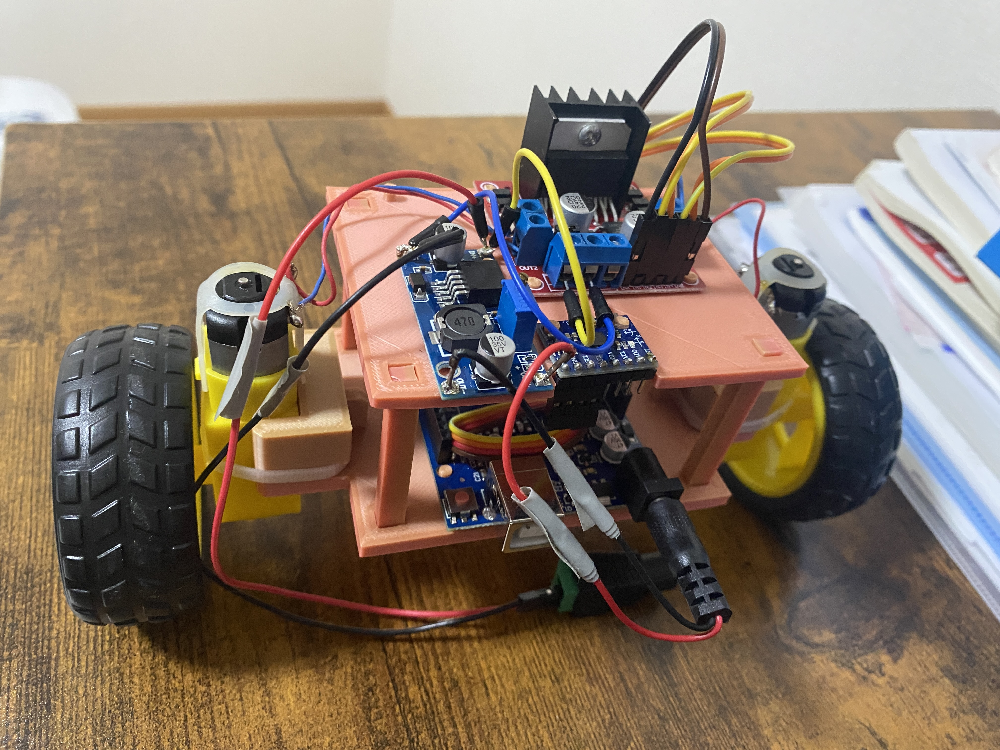

# 🤖 GarryBot

<p align="center">
  
</p>

<p align="center">
  
</p>

> **A self-balancing two-wheeled robot designed and programmed from scratch using Arduino Uno, MPU6050, and PlatformIO.**


---

# 📖 Overview

GarryBot is a self-balancing robot developed to explore embedded systems, robotics, and control engineering through hands-on implementation.

Rather than relying on third-party balancing libraries, every major subsystem—including the MPU6050 driver, complementary filter, PID controller, and motor driver—was implemented as a separate C++ module. The objective is to understand the engineering principles behind each component while developing clean, maintainable, and reusable embedded software.

---

# 🎯 Objectives

- Build a self-balancing robot from the ground up.
- Learn embedded C++ using PlatformIO.
- Understand IMU sensor fusion.
- Design and tune a PID controller.
- Develop a modular software architecture.
- Build a professional robotics portfolio project.

---

# ✨ Current Features

- ✅ MPU6050 IMU driver
- ✅ Gyroscope calibration
- ✅ Accelerometer angle estimation
- ✅ Complementary filter
- ✅ PID balancing controller
- ✅ PWM motor control
- ✅ Emergency stop
- ✅ Modular C++ architecture
- ✅ Stable self-balancing
---

# 🛠 Hardware

| Component | Description |
|-----------|-------------|
| Arduino Uno | Main microcontroller |
| MPU6050 | 6-axis IMU (Accelerometer + Gyroscope) |
| L298N | Dual H-Bridge motor driver |
| TT DC Motors | Drive motors |
| 12V adapter | Power source |
| LM2596 DC to DC Buck Converter  | Regulates voltage for the Arduino |

---
# 🏗️ Software Architecture

The robot software is organized into independent modules. Each module has a single responsibility, making the project easier to understand, debug, and extend.

```text
                +------------------+
                |    MPU6050 IMU   |
                +--------+---------+
                         |
                         v
                +------------------+
                | Complementary    |
                |     Filter       |
                +--------+---------+
                         |
                         v
                +------------------+
                | PID Controller   |
                +--------+---------+
                         |
                         v
                +------------------+
                |  Motor Driver    |
                +--------+---------+
                         |
                         v
                +------------------+
                |   DC Motors      |
                +------------------+
```
---

# 📂 Project Structure

```text
GarryBot/
├── include/               # Header files
│   ├── config.h
│   ├── filter.h
│   ├── imu.h
│   ├── motor.h
│   └── pid.h
│
├── src/                   # Source files
│   ├── main.cpp
│   ├── filter.cpp
│   ├── imu.cpp
│   ├── motor.cpp
│   └── pid.cpp
│
├── lib/                   # External libraries (if any)
├── test/                  # Unit tests
├── images/                # Images and GIFs
├── docs/                  # Documentation
│
├── platformio.ini         # PlatformIO configuration
├── README.md
└── .gitignore
```